# Electricity Price Forecasting — Parallel Hyperband with Daytona

---

## Origin

Built in **5 hours** for the [Daytona](https://daytona.io) Hackathon.

**Goal**: prove that parallel sandbox infrastructure can find better hyperparameter configurations faster than sequential search — by rebuilding the HPO pipeline from a prior MLOps project ([electricity-price-forecasting](https://github.com/jeannineshiu/electricity-price-forecasting)) on top of Daytona.

**Baseline**: Optuna sequential search, 30 trials → test MAE **7.23 EUR/MWh**  
**Result**: Daytona parallel Hyperband, 36 configs → test MAE **7.1754 EUR/MWh** ✅ (+0.76% improvement)

---

## Development Journey

### Hackathon (5 hours) — Core Foundation

Built and shipped during the Daytona Hackathon:

- 3-stage Hyperband orchestrator running 9 Daytona sandboxes in parallel
- LightGBM hyperparameter search across 36 configurations
- Beat the Optuna sequential baseline: **7.1754 vs 7.23 EUR/MWh**

### After the Hackathon — 4 Layers Added

After the hackathon, I identified four gaps and extended the project layer by layer:

**Layer 1 — Real-time Dashboard**

The CLI output told you a result had arrived, but not what was happening *right now*. Added a Streamlit dashboard where the leaderboard updates live as each sandbox completes — you can watch the parallel execution happen in real time.

**Layer 2 — Generic Model Interface**

The original pipeline had LightGBM hardcoded in `sandbox_train.py`. Refactored to a plugin model: adding XGBoost, CatBoost, or Random Forest required zero changes to the Hyperband algorithm. The search space and defaults live in `models/registry.py`; the orchestration layer never needs to know which model is running.

> "I didn't build a LightGBM tuner. I built a generic HPO framework where the model is a plugin."

**Layer 3 — LLM Agent**

The Hyperband search could find good configs, but it couldn't *diagnose* why results were bad or *decide* what to search next. Added a Claude-powered agent with two tools: one to read experiment history, one to launch a targeted Hyperband search. The agent reads past runs, identifies patterns, proposes a refined search space, launches Daytona sandboxes autonomously, and returns a structured report.

```
User: "My val MAE is 6.0 but test MAE is 7.5 — clear overfitting."
  ↓
Agent reads run history → identifies the val/test gap pattern
  ↓
Agent proposes: increase regularization, reduce num_leaves
  ↓
Agent launches 9 parallel Daytona sandboxes
  ↓
Agent: "Found test_mae 7.35. Gap narrowed from 1.5 → 1.12. Next: try CatBoost."
```

**Layer 4 — Experiment Tracking**

Results were only printed to stdout — no way to compare runs across sessions or identify which hyperparameters correlated with better MAE. Integrated MLflow: every trial is a nested run under a parent `hyperband_search` run, with full hyperparameters, stage-level MAE, and wall-clock time. The agent also maintains `run_history.json` so it remembers what's been tried across sessions.

---

## Why Daytona?

| | Traditional (local) | With Daytona |
|---|---|---|
| **Parallelism** | One trial at a time, blocking | Up to 9 sandboxes training simultaneously |
| **Isolation** | Shared environment, package conflicts possible | Each sandbox is fully isolated |
| **Setup cost** | Install packages every run | Snapshot pre-installs once; sandboxes boot instantly |
| **Resource cost** | Local CPU tied up during training | Compute runs remotely; local machine stays free |
| **Fault tolerance** | One crash stops everything | Failed sandboxes are skipped; search continues |
| **Reproducibility** | "Works on my machine" | Same snapshot = identical environment, always |
| **Scalability** | Rewrite needed to go parallel | Change one number (`N_BATCH = 9 → 90`) |

---

## System Overview

Three ways to run the same search engine:

```
┌──────────────────────────────────────────────────────┐
│  CLI              Dashboard           LLM Agent       │
│  python           streamlit run       python          │
│  orchestrator.py  dashboard/app.py   agent/           │
│                                      ml_engineer.py   │
└──────────────────┬───────────────────────────────────┘
                   │  shared core
         ┌─────────▼──────────┐
         │   config.py        │  MODEL_TYPE · N_BATCH · SNAPSHOT
         │   models/registry  │  Param samplers · Bounds · Seeds
         │   hyperband.py     │  stream_stage() — parallel generator
         │   daytona_executor │  run_sandbox() — Daytona SDK
         └─────────┬──────────┘
                   │
         ┌─────────▼──────────────────────────────┐
         │          Daytona Platform               │
         │   ┌──────────┐  ┌──────────┐  ×9 ∥    │
         │   │sandbox 1 │  │sandbox 2 │  ...      │
         │   │git clone │  │git clone │           │
         │   │train.py  │  │train.py  │           │
         │   └──────────┘  └──────────┘           │
         └────────────────────────────────────────┘
                   │
         ┌─────────▼──────────┐
         │   Observability     │
         │   MLflow (CLI)      │  Experiment tracking
         │   run_history.json  │  Agent memory across sessions
         └────────────────────┘
```

### 3-Stage Hyperband

```
Stage 1 — Fast Screen    36 configs × 10% data  → keep top 5 + seeds
Stage 2 — Medium Eval    10 configs × 33% data  → keep top 5
Stage 3 — Full Training   5 configs × 100% data → best config wins
```

Each stage eliminates the worst performers early, saving ~70% of compute vs training all 36 on full data.

---

## Technical Architecture

```mermaid
graph TB
    subgraph UI ["👤 Entry Points"]
        CLI["🖥️ CLI\norchestrator.py"]
        DASH["📊 Dashboard\ndashboard/app.py\nStreamlit"]
        AGENT["🤖 LLM Agent\nagent/ml_engineer.py\nClaude claude-opus-4-8"]
    end

    subgraph CORE ["💻 Local Core"]
        CONFIG["⚙️ config.py\nMODEL_TYPE · N_BATCH\nSNAPSHOT · BASELINE"]
        REGISTRY["📦 models/registry.py\nMODEL_DEFAULTS · MODEL_BOUNDS\nParam Samplers · Seeds"]
        HYPERBAND["🔀 hyperband.py\nstream_stage()\nThreadPoolExecutor"]
        EXECUTOR["🧱 daytona_executor.py\nrun_sandbox()\nDaytona SDK"]
    end

    subgraph OBS ["📈 Observability"]
        MLFLOW["📉 MLflow\nExperiment · Nested Runs"]
        HISTORY["🗂️ Run History\nrun_history.json"]
    end

    subgraph REMOTE ["☁️ Remote"]
        CLAUDE["🧠 Claude API\nclaude-opus-4-8\nTool Use"]
        DAYTONA["⚡ Daytona Platform\nSnapshot elec-forecast-v3\n9 sandboxes ∥"]
        GITHUB["📁 GitHub\nelectricity-hyperband"]
    end

    subgraph SB ["🔲 Daytona Sandbox × 9 parallel"]
        TRAIN["🏋️ sandbox_train.py\nLightGBM · XGBoost\nCatBoost · Random Forest"]
        DATA["🗄️ ENTSO-E Data\n43,680 hourly rows"]
    end

    CLI --> CONFIG
    DASH --> CONFIG
    AGENT --> CONFIG
    AGENT <--> CLAUDE

    CONFIG --> REGISTRY
    CONFIG --> EXECUTOR
    REGISTRY --> HYPERBAND
    HYPERBAND --> EXECUTOR
    EXECUTOR --> DAYTONA

    DAYTONA --> SB
    SB --> GITHUB
    GITHUB --> TRAIN
    DATA --> TRAIN
    TRAIN -->|result.json| EXECUTOR

    EXECUTOR -->|results stream| HYPERBAND
    HYPERBAND -->|yield| CLI
    HYPERBAND -->|yield| DASH
    HYPERBAND -->|yield| AGENT

    CLI --> MLFLOW
    CLI --> HISTORY
    DASH --> HISTORY
    AGENT --> HISTORY
```



---

## Real-time Dashboard


---

## MLflow Tracking


---

## Getting Started

### Prerequisites

```bash
pip install daytona lightgbm xgboost catboost scikit-learn \
            pandas pyarrow numpy mlflow streamlit anthropic
```

```bash
export DAYTONA_API_KEY="your-daytona-api-key"
export ANTHROPIC_API_KEY="your-anthropic-api-key"   # for LLM agent only
```

### 1. Build the snapshot (run once)

```bash
python setup_snapshot_v3.py
```

Pre-installs all packages into a Daytona snapshot. All subsequent sandboxes boot from this snapshot instantly — no per-run install overhead.

### 2. Run the search

**CLI**
```bash
python orchestrator.py
```

**Dashboard** (recommended for demos)
```bash
streamlit run dashboard/app.py
# Open http://localhost:8501 — select model, click ▶ Start
```

**LLM Agent** (natural language)
```bash
python agent/ml_engineer.py "My val MAE is 6.0 but test MAE is 7.5 — overfitting. What should I try?"
# Agent reads history, proposes a refined search space, launches sandboxes, returns a report
```

**View MLflow results**
```bash
mlflow ui --port 5001
# Open http://localhost:5001
```

### Switching models

Change one line in `config.py`:

```python
MODEL_TYPE = "xgboost"   # "lightgbm" | "xgboost" | "catboost" | "rf"
```

Or select from the dropdown in the dashboard — no code changes needed.

---

## Project Structure

```
electricity-hyperband/
├── config.py                 # Constants: MODEL_TYPE, N_BATCH, SNAPSHOT…
├── models/registry.py        # MODEL_DEFAULTS, MODEL_BOUNDS, param samplers
├── daytona_executor.py       # Daytona client + run_sandbox()
├── hyperband.py              # stream_stage() — pure parallel search
├── orchestrator.py           # CLI entry point: run_hyperband()
├── sandbox_train.py          # Runs inside Daytona: LGB / XGB / CatBoost / RF
├── setup_snapshot_v3.py      # One-time snapshot setup
├── tracking/mlflow_logger.py # MLflow helpers
├── dashboard/app.py          # Streamlit real-time dashboard
├── agent/
│   ├── ml_engineer.py        # LLM agent — Claude API + tool use
│   ├── history.py            # Shared run history (CLI + dashboard + agent)
│   └── run_history.json      # Persistent memory across sessions
├── experimental/             # LSTM Hyperband — complete but not yet verified
└── data/
    └── features_2020_2024.parquet
```

---

## Future Direction

### Distributed Hyperparameter Optimization Platform

The current project demonstrates the core infrastructure pattern. The next step is a **generic platform** that any user can run on any dataset:

```
User Upload CSV
      ↓
Feature Detection        — infer column types, temporal structure, missing values
      ↓
Auto Model Selection     — run quick baselines across model types
      ↓
Auto HPO                 — Hyperband parallel search (this project)
      ↓
Deploy REST API          — serve the best model as an endpoint
      ↓
Monitor Drift            — detect distribution shift over time, trigger re-training
```

**Why Daytona makes this possible**: each stage above maps naturally to isolated, ephemeral sandboxes. Feature detection, baseline runs, HPO trials, model serving — all can run in parallel sandboxes provisioned on demand, deleted when done. The orchestration code doesn't change; only the tasks inside the sandboxes do.
