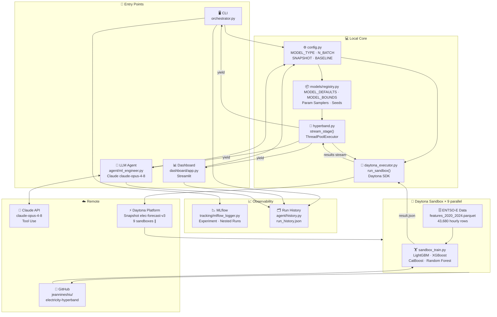
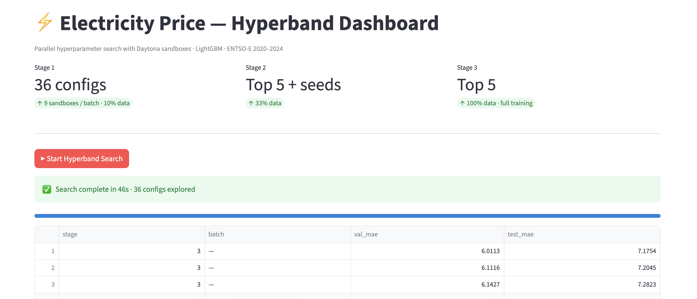
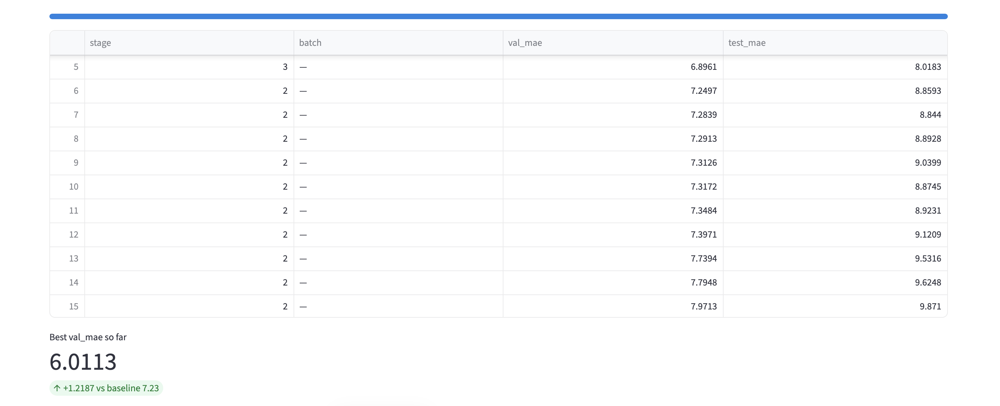
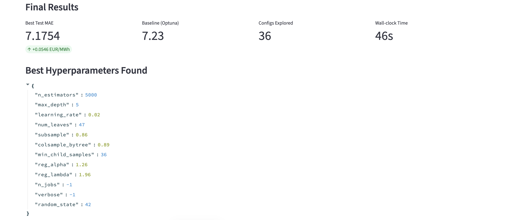
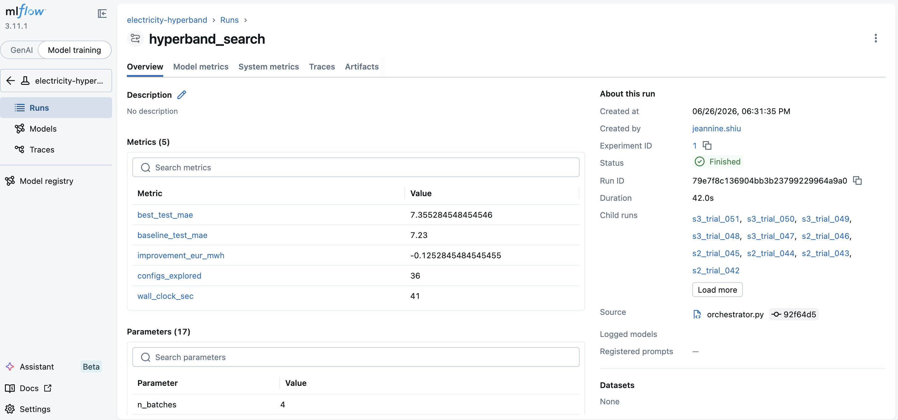

# Electricity Price Forecasting — Parallel Hyperband with Daytona

> Beat a sequential Optuna baseline (MAE 7.23) using parallel Hyperband search across Daytona sandboxes.
> **Final result: MAE 7.1754 EUR/MWh** (+0.055 improvement)

---

## Inspiration

This project is built upon ideas and baselines from a prior MLOps project:
**[electricity-price-forecasting](https://github.com/jeannineshiu/electricity-price-forecasting)**

That project established the ENTSO-E data pipeline, LightGBM feature engineering, and the Optuna sequential search baseline (MAE 7.23) that this Hyperband implementation aims to surpass.

---

## Overview

This project implements a **3-stage Hyperband hyperparameter search** across multiple model types, using [Daytona](https://daytona.io) to run training jobs in massively parallel sandboxes — with **MLflow** for experiment tracking, a **Streamlit dashboard** for real-time visualization, and a **Claude-powered LLM agent** that diagnoses problems and launches targeted searches autonomously.

The Hyperband is designed as a **generic HPO framework** — the model is a plugin. Switching from LightGBM to XGBoost, CatBoost, or Random Forest requires changing one line. The orchestration logic stays identical.

---

## Architecture

### How the system works

The system has **three entry points** that all share the same core engine:

- **CLI** (`orchestrator.py`) — runs the full 3-stage Hyperband search from the terminal, logs everything to MLflow
- **Dashboard** (`dashboard/app.py`) — same search with a live Streamlit UI showing the leaderboard as each sandbox completes
- **LLM Agent** (`agent/ml_engineer.py`) — Claude claude-opus-4-8 reads past run history, diagnoses problems, and autonomously launches targeted searches

All three entry points read from the same **`config.py`** (model type, batch size, snapshot name) and call the same **`hyperband.stream_stage()`** to run sandboxes.

When a search starts, this is what happens step by step:

1. **`models/registry.py`** samples a hyperparameter config for the chosen model
2. **`daytona_executor.py`** creates a Daytona sandbox from a pre-built snapshot (packages already installed — no setup overhead)
3. The sandbox clones the GitHub repo, writes the config, and runs **`sandbox_train.py`** with one of four models (LightGBM / XGBoost / CatBoost / Random Forest)
4. Training completes and the result is streamed back to **`hyperband.stream_stage()`**
5. Up to 9 sandboxes run simultaneously — all returning results as they finish
6. After Stage 1, the worst configs are eliminated. Survivors train on more data in Stage 2, and the best train on the full dataset in Stage 3
7. Every result is saved to **MLflow** (CLI path) and **`run_history.json`** (all paths), so the agent remembers what's been tried across sessions



---

## Results

| Method | Trials | Style | Test MAE |
|---|---|---|---|
| Optuna (baseline) | 30 | Sequential | 7.2300 EUR/MWh |
| **Hyperband + Daytona** | **36** | **Parallel** | **7.1754 EUR/MWh** ✅ |

**Improvement: +0.055 EUR/MWh (0.76% better than baseline)**

---

## System Architecture

```
┌─────────────────────────────────────────────────────┐
│                   orchestrator.py                   │
│         MODEL_TYPE = "lightgbm" | "xgboost"        │
│               "catboost" | "rf"                     │
│                                                     │
│  ThreadPoolExecutor → 9 Daytona sandboxes at once  │
│                       ↓                            │
│              MLflow tracking (localhost)            │
└─────────────────────────────────────────────────────┘
                        │
          ┌─────────────┼─────────────┐
          ▼             ▼             ▼
   [Sandbox 1]   [Sandbox 2]  ... [Sandbox 9]
   git clone      git clone        git clone
   sandbox_train  sandbox_train    sandbox_train
   --model lgb    --model lgb      --model lgb
   → result.json  → result.json   → result.json
```

### 3-Stage Hyperband

```
Stage 1 — Fast Screen (10% of training data, early_stop=10)
  4 batches × 9 sandboxes = 36 configs explored in parallel
  → Keep Top 5

Stage 2 — Medium Evaluation (33% of training data, early_stop=30)
  10 sandboxes in parallel (Top 5 from Stage 1 + 5 seeds)
  → Keep Top 5

Stage 3 — Full Training (100% of training data, early_stop=100)
  5 sandboxes in parallel
  → Best config wins
```

Each stage uses progressively more data. Configs that perform poorly are eliminated early, saving ~70% of compute compared to training all 36 on full data.

---

## Supported Models

| Model | Key Parameters | Notes |
|---|---|---|
| **LightGBM** | `num_leaves`, `learning_rate`, `n_estimators`, regularization | Default; best result on this dataset |
| **XGBoost** | `max_depth`, `learning_rate`, `gamma`, `min_child_weight` | Early stopping via `fit()` |
| **CatBoost** | `depth`, `iterations`, `l2_leaf_reg`, `rsm` | Bootstrap type set to Bernoulli |
| **Random Forest** | `max_depth`, `min_samples_split`, `max_features` | No early stopping; stage size controls compute |

Switch model with one line in `orchestrator.py`:

```python
MODEL_TYPE = "xgboost"   # "lightgbm" | "xgboost" | "catboost" | "rf"
```

Or select from the dropdown in the Streamlit dashboard — **no code changes needed**.

---

## Dataset

- **Source**: ENTSO-E European day-ahead electricity prices
- **File**: `data/features_2020_2024.parquet` (43,680 hourly rows)
- **Features**: lag features (1h, 24h, 168h), rolling statistics, calendar features
- **Split**:
  - Train: 2020–2022
  - Validation: 2023
  - Test: 2024

---

## Project Structure

```
electricity-hyperband/
├── config.py                 # All constants (SNAPSHOT, MODEL_TYPE, N_BATCH…)
├── models/
│   ├── __init__.py
│   └── registry.py           # MODEL_DEFAULTS, MODEL_BOUNDS, param samplers, seeds
├── daytona_executor.py       # Daytona client + run_sandbox()
├── hyperband.py              # stream_stage() — pure parallel search, no MLflow
├── orchestrator.py           # run_parallel() + run_hyperband() — CLI entry point
├── sandbox_train.py          # Generic training script (runs inside Daytona sandbox)
├── setup_snapshot_v3.py      # One-time setup: snapshot with all 4 model packages
├── tracking/
│   ├── __init__.py
│   └── mlflow_logger.py      # MLflow helpers
├── dashboard/
│   ├── __init__.py
│   └── app.py                # Streamlit real-time dashboard
├── agent/
│   ├── __init__.py
│   ├── history.py            # Run history load/save (shared by CLI + agent)
│   ├── ml_engineer.py        # LLM agent — Claude API + tool use
│   └── run_history.json      # Persistent experiment memory (auto-generated)
├── experimental/             # Architecturally complete, not yet verified end-to-end
│   ├── README.md             # Known issues + how to resume development
│   ├── orchestrator_lstm.py
│   ├── sandbox_train_lstm.py
│   └── setup_snapshot_lstm.py
└── data/
    └── features_2020_2024.parquet
```

---

## How It Works

### 1. Setup (run once)

```bash
python setup_snapshot_v3.py
```

Creates a Daytona snapshot (`elec-forecast-v3`) with all four model packages pre-installed:
`lightgbm 4.6.0` · `xgboost 3.3.0` · `catboost 1.2.10` · `scikit-learn 1.8.0`

All subsequent sandboxes boot from this snapshot — no per-sandbox install overhead.

### 2. Run the Hyperband search (CLI)

```bash
python orchestrator.py
```

The orchestrator:
1. Reads `MODEL_TYPE` to select the active model and its param sampler
2. Starts an MLflow parent run (`hyperband_search`)
3. Spawns 9 sandboxes in parallel for each Stage 1 batch
4. Each sandbox runs `sandbox_train.py --model {MODEL_TYPE}`
5. Results are collected, logged to MLflow, and worst configs are eliminated
6. Survivors advance to the next stage with more training data

### 3. Run via Dashboard (recommended for demos)

```bash
streamlit run dashboard/app.py
# Open http://localhost:8501
```

Select model from dropdown, click **▶ Start** — leaderboard updates live as each sandbox completes.

### 4. View experiment results in MLflow

```bash
mlflow ui --port 5001
# Open http://localhost:5001
```

### 5. Ask the LLM Agent

```bash
python agent/ml_engineer.py "My val MAE is 6.0 but test MAE is 7.5 — overfitting to 2023. What should I try?"
```

The agent will:
1. Read experiment history to understand what's been tried
2. Diagnose the problem and propose a targeted search space
3. Launch Daytona sandboxes autonomously to run the search
4. Return a structured report with findings and next steps

---

## Requirements

```bash
pip install daytona lightgbm xgboost catboost scikit-learn pandas pyarrow numpy mlflow streamlit anthropic
```

Set your API keys:

```bash
export DAYTONA_API_KEY="your-daytona-api-key"
export ANTHROPIC_API_KEY="your-anthropic-api-key"   # required for LLM agent
```

---

## Real-time Dashboard

Select model, click **▶ Start**. The leaderboard updates live as each sandbox completes.







---

## MLflow Tracking

Every Hyperband run is fully logged to MLflow:

| What is tracked | Where |
|---|---|
| Search config (`n_batches`, `top_s2`, `top_s3`, `baseline`) | Parent run — params |
| Each trial's full hyperparameters | Nested run — params |
| `val_mae` and `test_mae` per trial | Nested run — metrics |
| Stage and batch tags | Nested run — tags |
| Best params, best MAE, improvement, wall-clock time | Parent run — metrics |

Run names follow `s{stage}_b{batch}_trial_{n}` format (e.g. `s1_b2_trial_015`) for easy navigation in the UI.



---

## LLM ML Engineer Agent

The agent uses **Claude claude-opus-4-8 + Tool Use** to act as an autonomous ML engineer: it reads experiment history, diagnoses the problem, proposes a refined search space, and launches Daytona sandboxes — all from a single natural-language prompt.

```
User: "My val MAE is 6.0 but test MAE is 7.5 — clear overfitting to 2023."
  ↓
Agent calls: read_experiment_history
  ↓
Agent calls: launch_hyperband(model="lightgbm", search_space={...}, reasoning="...")
  ↓
Daytona runs 9 parallel sandboxes → top 3 → best 1 (full training)
  ↓
Agent: "Found test_mae 7.35 — gap narrowed from 1.5 to 1.12.
        Recommend fine-grained search around num_leaves∈[55,71], reg_lambda∈[2.5,4.5]"
```

### Tools available to the agent

| Tool | Description |
|---|---|
| `read_experiment_history` | Reads `agent/run_history.json` — all past runs, params, and MAEs |
| `launch_hyperband` | Launches a mini 3-stage Hyperband (n→3→1) on Daytona with a refined search space |

### Safety

- **Param bounds validation**: the agent cannot propose values outside safe ranges (e.g. `learning_rate > 0.5`, `num_leaves > 300`)
- **Sandbox limit enforcement**: `n_trials` clamped to ≤ 9 (Daytona concurrency limit)
- **Persistent memory**: every run is saved to `agent/run_history.json`, so the agent learns across sessions

---

## Why Daytona?

| Property | What it means in practice |
|---|---|
| **Isolation** | Each sandbox is an independent environment — no package conflicts, one crash doesn't cascade |
| **Snapshot** | Environment setup cost is paid once, not once per trial |
| **Ephemeral Compute** | `sb.delete()` after training — no idle servers, pay for seconds used |
| **Reproducibility** | Same snapshot + same code = identical environment, reproducible results |
| **Scalability** | Change `N_BATCH = 9` to `N_BATCH = 90` — orchestrator code stays the same |
| **Fault Tolerance** | Failed sandboxes are skipped, search continues with remaining results |

---

## Best Found Configuration

```json
{
  "model": "lightgbm",
  "n_estimators": 5000,
  "max_depth": 5,
  "learning_rate": 0.02,
  "num_leaves": 47,
  "subsample": 0.86,
  "colsample_bytree": 0.89,
  "min_child_samples": 36,
  "reg_alpha": 1.26,
  "reg_lambda": 1.96,
  "random_state": 42
}
```

**Test MAE: 7.1754 EUR/MWh**

---

## Roadmap

- [x] 3-stage Hyperband with Daytona parallel sandboxes
- [x] MLflow experiment tracking
- [x] Real-time Streamlit dashboard
- [x] Generic model interface (LightGBM / XGBoost / CatBoost / Random Forest)
- [x] LLM-powered ML agent (Claude claude-opus-4-8 — diagnose → suggest → launch → report)
- [ ] Full forecasting platform (upload CSV → auto HPO → deploy API → monitor drift)
