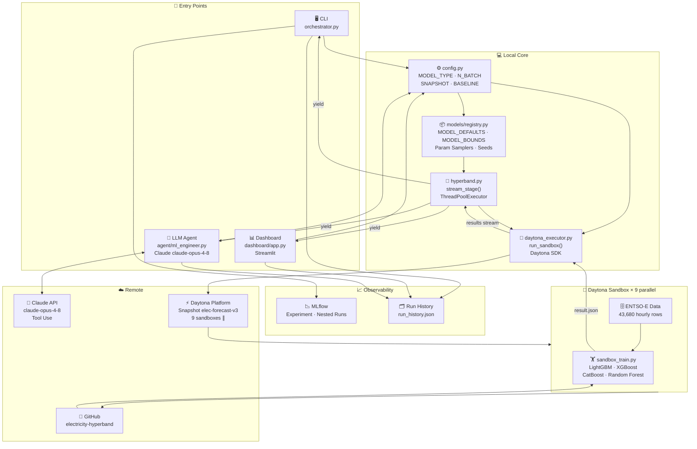

# Electricity Price Forecasting — Parallel Hyperband with Daytona

---

## Origin

Built in **5 hours** for the [Daytona](https://daytona.io) Hackathon.

**Goal**: prove that parallel sandbox infrastructure can find better hyperparameter configurations faster than sequential search — by rebuilding the HPO pipeline from a prior MLOps project ([electricity-price-forecasting](https://github.com/jeannineshiu/electricity-price-forecasting)) on top of Daytona.

**Baseline**: Optuna sequential search, 30 trials → test MAE **7.23 EUR/MWh**  
**Result**: Daytona parallel Hyperband, 36 configs → test MAE **7.1754 EUR/MWh** ✅ (+0.76% improvement)

---

## Development Journey

### Hackathon (5 hours) — Core Foundation

Built and shipped during the Daytona Hackathon. Beat the baseline on the first day.

```
orchestrator.py
      ↓
daytona_executor  →  9 Daytona sandboxes (parallel)
      ↓
sandbox_train.py  →  train + evaluate
      ↓
collect results   →  sort by val_mae
      ↓
promote survivors →  next stage with more data
      ↓
Stage 1 (10%) → Stage 2 (33%) → Stage 3 (100%)
```

| Engineering Capability | What it demonstrates |
|---|---|
| **Complete orchestration pipeline** | Not just a training script. A full system: orchestrator → Daytona → sandbox → collect results → promote → next stage. Shows understanding of ML systems, not just ML models. |
| **Distributed systems thinking** | 36 configs enter → 9 survive Stage 1 → 5 survive Stage 2 → 1 winner. Multi-stage tournament elimination mirrors how production HPO frameworks (Ray Tune, Optuna Distributed) allocate compute. |
| **Resource-aware scheduling** | Progressive data loading (10%→33%→100%) is the core insight of Hyperband: spend almost no compute on bad configs, and full compute only on proven candidates. This is the same principle as curriculum learning and progressive training in large model training. |
| **Genuine infrastructure usage** | Daytona Snapshots eliminate per-sandbox install overhead. Parallel sandboxes run concurrently with `ThreadPoolExecutor`. `sb.delete()` in `finally` blocks ensures zero idle cost. Not a demo wrapper — actual production patterns. |

---

### After the Hackathon — 4 Layers Added

---

**Layer 1 — Real-time Dashboard**

The CLI printed results as they arrived, but gave no sense of parallelism happening — a user watching the terminal couldn't tell if 1 or 9 sandboxes were running. Built a Streamlit dashboard where the leaderboard updates live as each sandbox completes.

| Engineering Capability | What it demonstrates |
|---|---|
| **Streaming architecture** | `stream_stage()` is a Python generator that yields one result per sandbox as it finishes. The dashboard consumes this stream directly — results appear one by one, not in a batch at the end. This is the same event-driven pattern used in real-time ML monitoring systems. |
| **Decoupled UI from algorithm** | The dashboard is a pure consumer of `stream_stage()`. Zero changes to Hyperband, the executor, or the training script. Demonstrates interface design: the algorithm doesn't know or care who is listening to its output. |
| **Observability as a first-class concern** | You can't improve what you can't see. Making parallelism *visible* — watching 9 results land nearly simultaneously — is what turns an infrastructure claim into something a stakeholder can actually verify. |


---

**Layer 2 — Generic Model Interface**

The original pipeline had LightGBM hard-coded across `sandbox_train.py` and `orchestrator.py`. Switching to XGBoost would have required editing both files and understanding both codebases. Refactored to a plugin architecture: `MODEL_TYPE = "xgboost"` in `config.py` switches the entire pipeline.

| Engineering Capability | What it demonstrates |
|---|---|
| **Plugin / registry pattern** | `models/registry.py` is a single source of truth: model defaults, valid hyperparameter bounds, and sampling functions all live in one place. Adding a new model is adding one entry to each dict. |
| **Interface contract** | `sandbox_train.py` exposes a `--model` flag. Each model has its own `fit_*()` function handling framework-specific APIs (LightGBM uses callbacks, XGBoost uses `early_stopping_rounds` in `fit()`, CatBoost requires `bootstrap_type="Bernoulli"` for row sampling). The Hyperband algorithm sees none of this — it only sees `val_mae` and `test_mae`. |
| **Separation of concerns** | The search algorithm (Hyperband) is now fully decoupled from the model implementation. This is the open/closed principle in ML systems: the framework is closed for modification, open for extension. |

> "I didn't build a LightGBM tuner. I built a generic HPO framework where the model is a plugin."

---

**Layer 3 — LLM Agent**

The Hyperband search could find good configs, but it was stateless — it had no memory of past runs and couldn't reason about *why* results were good or bad. Added a Claude claude-opus-4-8 agent with tool use: it reads experiment history, diagnoses the problem, proposes a targeted search space, and launches Daytona sandboxes autonomously.

```
User: "My val MAE is 6.0 but test MAE is 7.5 — clear overfitting."
  ↓
Agent reads run history → identifies the val/test gap pattern
  ↓
Agent proposes: increase reg_lambda, reduce num_leaves, higher min_child_samples
  ↓
Agent launches 9 parallel Daytona sandboxes with refined search space
  ↓
Agent: "Found test_mae 7.35. Gap narrowed from 1.5 → 1.12. Next: try CatBoost."
```

| Engineering Capability | What it demonstrates |
|---|---|
| **Tool-augmented LLM** | Claude doesn't generate text about hyperparameters — it calls real tools that launch actual Daytona sandboxes. `launch_hyperband` is a blocking tool call that returns only after all sandboxes complete. This is the agentic pattern: LLM as orchestrator, not just text generator. |
| **Persistent memory across sessions** | `run_history.json` gives the agent long-term memory. On each call, the agent reads what has been tried before — which models, which search spaces, what results — so it doesn't repeat failed experiments. |
| **Closed-loop experimentation** | Read → Diagnose → Propose → Execute → Report. A full scientific experimentation loop, automated. This mirrors how AutoML systems like Google Vizier work internally, but with an LLM as the strategy layer instead of a Bayesian optimizer. |
| **Safety guardrails** | `_validate_search_space()` prevents the agent from proposing values outside safe bounds (e.g., `learning_rate=999`, `max_depth=-1`). LLMs hallucinate; the tool layer must validate before executing. |

---

**Layer 4 — Experiment Tracking**

Results were only available in the current terminal session. There was no way to compare runs across sessions, identify which hyperparameters correlated with better MAE, or give the agent structured access to history. Integrated MLflow and a shared `run_history.json`.

| Engineering Capability | What it demonstrates |
|---|---|
| **Hierarchical experiment tracking** | Parent run = one Hyperband search. Nested runs = each individual trial, tagged with `stage` and `batch`. This mirrors how Weights & Biases and MLflow are used in production: sweeps contain runs contain metrics. |
| **Dual observability layers** | MLflow (CLI path) provides structured, queryable metrics for humans and dashboards. `run_history.json` (all paths) provides agent-readable history in a format the LLM can reason over. Two consumers with different needs get different representations of the same data. |
| **Cross-session comparability** | Every trial — its hyperparameters, val MAE, test MAE, stage, and wall-clock time — is logged permanently. This enables questions like "which `num_leaves` values consistently produced low test MAE?" that are impossible without persistent tracking. |


---

## Why Daytona?

| | Traditional (local) | With Daytona |
|---|---|---|
| **Parallelism** | One trial at a time, blocking | Up to 9 sandboxes training simultaneously |
| **Isolation** | Shared environment, package conflicts possible | Each sandbox is fully isolated |
| **Setup cost** | Install packages every run | Snapshot pre-installs once; sandboxes boot instantly |
| **Resource cost** | Local CPU tied up during training | Compute runs remotely; local machine stays free |
| **Fault tolerance** | One crash stops everything | Failed sandboxes are skipped; search continues |
| **Reproducibility** | "Works on my machine" | Same snapshot = identical environment, always |
| **Scalability** | Rewrite needed to go parallel | Change one number (`N_BATCH = 9 → 90`) — no orchestration code changes, only account tier |

---

## System Overview

Three ways to run the same search engine:

```
┌──────────────────────────────────────────────────────┐
│  CLI              Dashboard           LLM Agent       │
│  python           streamlit run       python          │
│  orchestrator.py  dashboard/app.py   agent/           │
│                                      ml_engineer.py   │
└──────────────────┬───────────────────────────────────┘
                   │  shared core
         ┌─────────▼──────────┐
         │   config.py        │  MODEL_TYPE · N_BATCH · SNAPSHOT
         │   models/registry  │  Param samplers · Bounds · Seeds
         │   hyperband.py     │  stream_stage() — parallel generator
         │   daytona_executor │  run_sandbox() — Daytona SDK
         └─────────┬──────────┘
                   │
         ┌─────────▼──────────────────────────────┐
         │          Daytona Platform               │
         │   ┌──────────┐  ┌──────────┐  ×9 ∥    │
         │   │sandbox 1 │  │sandbox 2 │  ...      │
         │   │git clone │  │git clone │           │
         │   │train.py  │  │train.py  │           │
         │   └──────────┘  └──────────┘           │
         └────────────────────────────────────────┘
                   │
         ┌─────────▼──────────┐
         │   Observability     │
         │   MLflow (CLI)      │  Experiment tracking
         │   run_history.json  │  Agent memory across sessions
         └────────────────────┘
```

### 3-Stage Hyperband

```
Stage 1 — Fast Screen    36 configs × 10% data  → keep top 5 + seeds
Stage 2 — Medium Eval    10 configs × 33% data  → keep top 5
Stage 3 — Full Training   5 configs × 100% data → best config wins
```

Each stage eliminates the worst performers early, saving ~70% of compute vs training all 36 on full data.

---

## Technical Architecture



---

## Getting Started

### Prerequisites

```bash
pip install daytona lightgbm xgboost catboost scikit-learn \
            pandas pyarrow numpy mlflow streamlit anthropic
```

```bash
export DAYTONA_API_KEY="your-daytona-api-key"
export ANTHROPIC_API_KEY="your-anthropic-api-key"   # for LLM agent only
```

### 1. Build the snapshot (run once)

```bash
python setup_snapshot_v3.py
```

Pre-installs all packages into a Daytona snapshot. All subsequent sandboxes boot from this snapshot instantly — no per-run install overhead.

### 2. Run the search

**CLI**
```bash
python orchestrator.py
```

**Dashboard** (recommended for demos)
```bash
streamlit run dashboard/app.py
# Open http://localhost:8501 — select model, click ▶ Start
```

**LLM Agent** (natural language)
```bash
python agent/ml_engineer.py "My val MAE is 6.0 but test MAE is 7.5 — overfitting. What should I try?"
# Agent reads history, proposes a refined search space, launches sandboxes, returns a report
```

**View MLflow results**
```bash
mlflow ui --port 5001
# Open http://localhost:5001
```

### Switching models

Change one line in `config.py`:

```python
MODEL_TYPE = "xgboost"   # "lightgbm" | "xgboost" | "catboost" | "rf"
```

Or select from the dropdown in the dashboard — no code changes needed.

---

## Project Structure

```
electricity-hyperband/
├── config.py                 # Constants: MODEL_TYPE, N_BATCH, SNAPSHOT…
├── models/registry.py        # MODEL_DEFAULTS, MODEL_BOUNDS, param samplers
├── daytona_executor.py       # Daytona client + run_sandbox()
├── hyperband.py              # stream_stage() — pure parallel search
├── orchestrator.py           # CLI entry point: run_hyperband()
├── sandbox_train.py          # Runs inside Daytona: LGB / XGB / CatBoost / RF
├── setup_snapshot_v3.py      # One-time snapshot setup
├── tracking/mlflow_logger.py # MLflow helpers
├── dashboard/app.py          # Streamlit real-time dashboard
├── agent/
│   ├── ml_engineer.py        # LLM agent — Claude API + tool use
│   ├── history.py            # Shared run history (CLI + dashboard + agent)
│   └── run_history.json      # Persistent memory across sessions
├── experimental/             # LSTM Hyperband — complete but not yet verified
└── data/
    └── features_2020_2024.parquet
```

---

## Future Direction

### Distributed Hyperparameter Optimization Platform

The current project demonstrates the core infrastructure pattern. The next step is a **generic platform** that any user can run on any dataset:

```
User Upload CSV
      ↓
Feature Detection        — infer column types, temporal structure, missing values
      ↓
Auto Model Selection     — run quick baselines across model types
      ↓
Auto HPO                 — Hyperband parallel search (this project)
      ↓
Deploy REST API          — serve the best model as an endpoint
      ↓
Monitor Drift            — detect distribution shift over time, trigger re-training
```

**Why Daytona makes this possible**: each stage above maps naturally to isolated, ephemeral sandboxes. Feature detection, baseline runs, HPO trials, model serving — all can run in parallel sandboxes provisioned on demand, deleted when done. The orchestration code doesn't change; only the tasks inside the sandboxes do.
